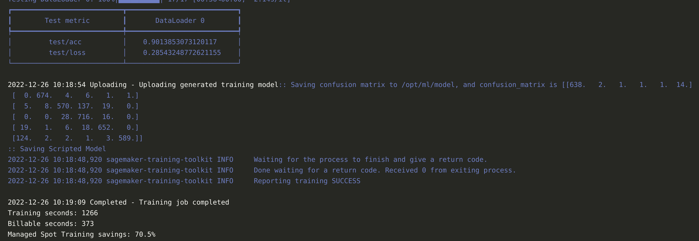
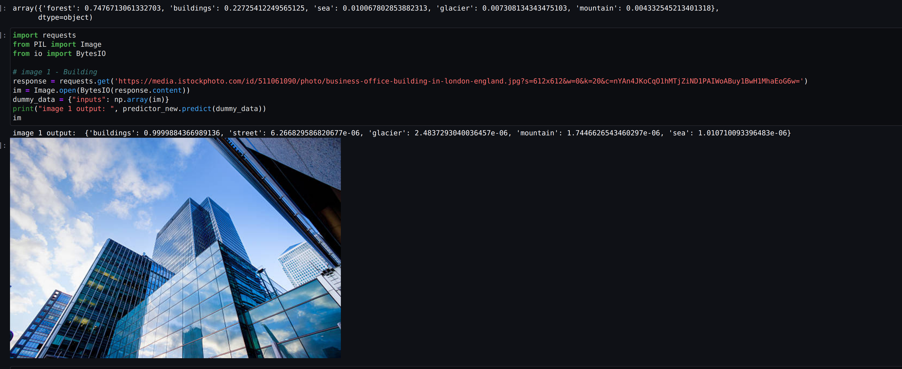
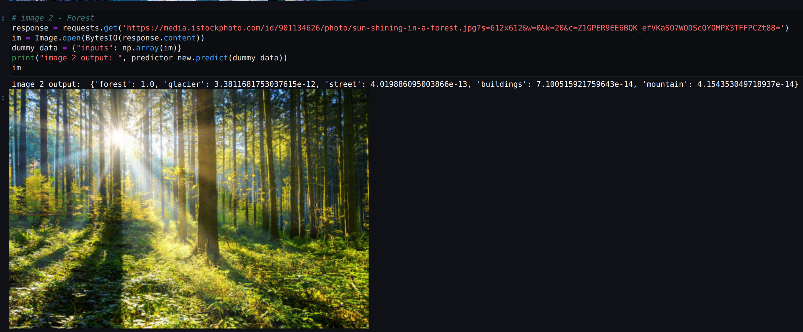
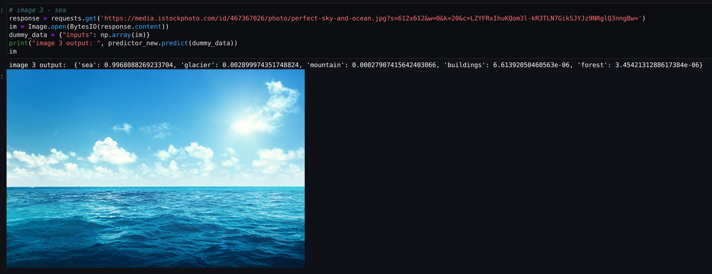
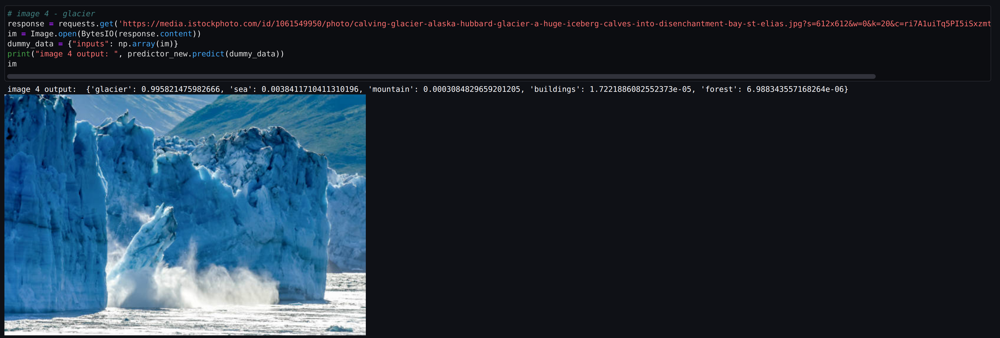
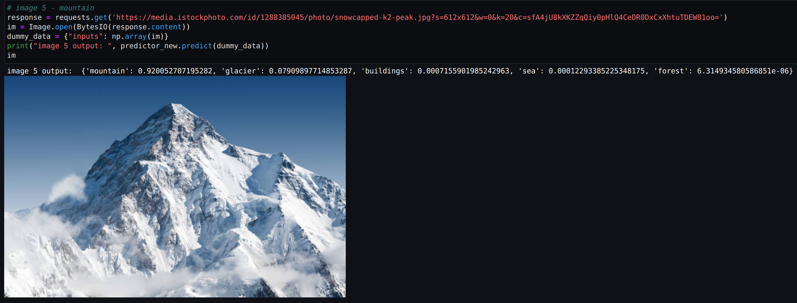

# Custom Docker
<!-- link to Dockerfile in local directory -->
[link to Dockerfile in local directory](./Dockerfile)
<!-- paste code-->
```FROM 763104351884.dkr.ecr.ap-south-1.amazonaws.com/pytorch-training:1.12.1-gpu-py38-cu113-ubuntu20.04-sagemaker

ARG NB_USER="sagemaker-user"
ARG NB_UID="1000"
ARG NB_GID="100"

# Setup the "sagemaker-user" user with root privileges.
RUN \
    apt-get update && \
    apt-get install -y sudo && \
    useradd -m -s /bin/bash -N -u $NB_UID $NB_USER && \
    chmod g+w /etc/passwd && \
    echo "${NB_USER}    ALL=(ALL)    NOPASSWD:    ALL" >> /etc/sudoers && \
    # Prevent apt-get cache from being persisted to this layer.
    rm -rf /var/lib/apt/lists/*

USER $NB_UID

ENV PATH="/home/sagemaker-user/.local/bin:/opt/ml/code:${PATH}"

COPY requirements.txt /tmp/requriements.txt

RUN pip3 install -r /tmp/requriements.txt

WORKDIR /opt/ml/code

```
# NOTE: 
1. I couldn't get my g4dn.xlarge service quota approved, so I'm using cpu instance for training. I'll update this once I get my quota approved.
2. The pre-process, training and inference scripts are inside `intel-project/emlov2-session-12`
# Model Evaluation metrics


Also present in training notebook [here](intel-project/03-train.ipynb)

# Inference Images







tensorboard logs [here](https://tensorboard.dev/experiment/ndALwfMySv6p7AvHWrXfBQ/#scalars)